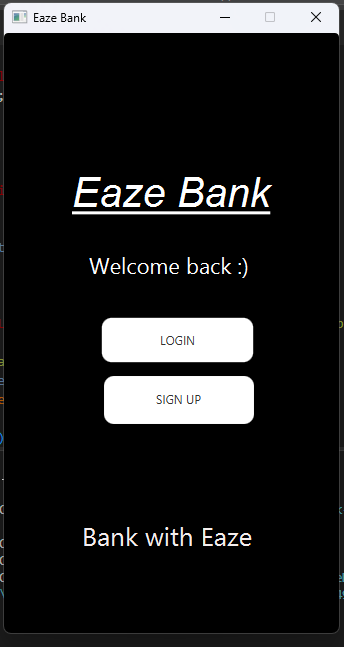
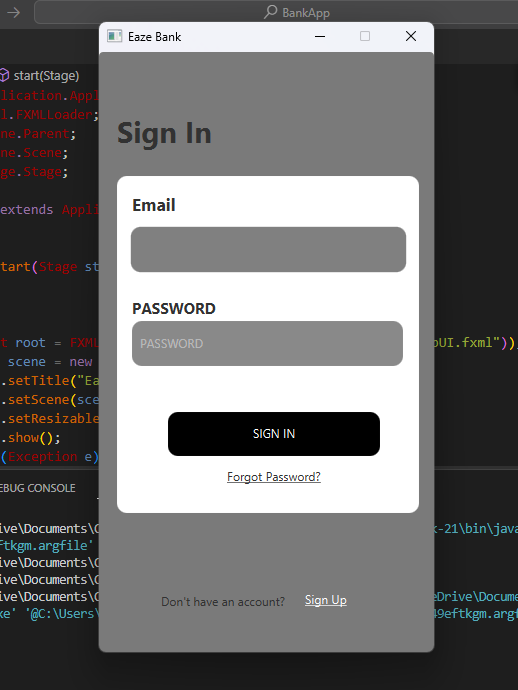
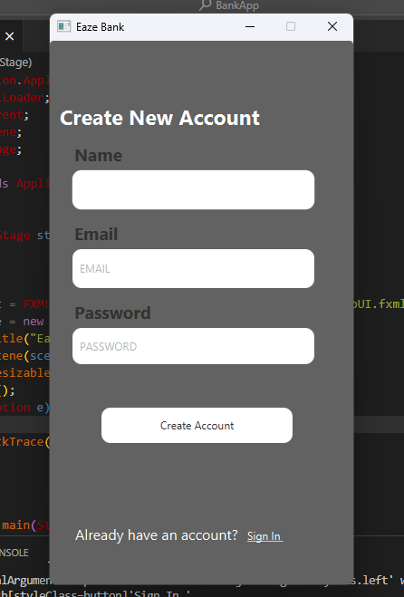
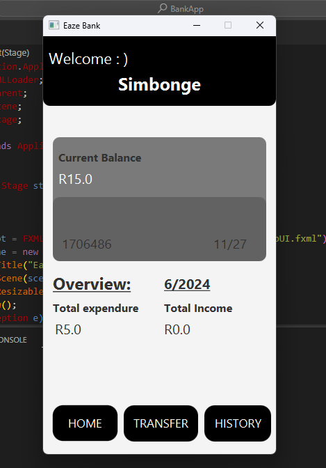
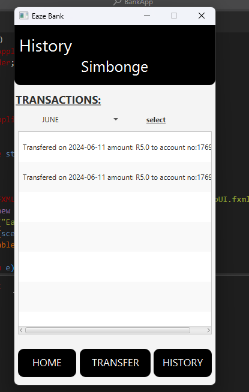

# BankApp: A JavaFX Banking System

BankApp is an innovative mobile application designed to emulate the functionalities of a real-world banking system. Developed in Java, it features a user-friendly interface crafted with JavaFX, ensuring seamless user interactions. The application establishes secure database connections using JDBC and stores data in a MySQL database, providing a stable and reliable backend.

A key focus of the project was to implement robust user authentication mechanisms. Users can confidently log in with their credentials, knowing their data is protected. The project was also an educational journey into database management and the critical role of security in financial software.

To safeguard sensitive user information, the application employs a combination of advanced cryptographic techniques. Passwords are stored using SHA-3 (Secure Hash Algorithm 3), enhanced with salting to thwart unauthorized access attempts. This approach to security underscores the application’s commitment to protecting user privacy.

Overall, the BankApp project was a valuable learning experience, significantly bolstering technical expertise and offering deep insights into designing software that prioritizes user needs and security.

## Features Implemented

1. **User Authentication**:
    - Users can log in using their credentials.
    - Passwords are securely hashed and stored in the database.

2. **Account Management**:
    - Users can view their account details (balance, account number, etc.).
    - Transactions (deposits, withdrawals) are recorded.

3. **Database Integration**:
    - JDBC is used to connect to the MySQL database.
    - Database schema includes tables for users, accounts, and transactions.

## APP OVERVIEW 
### Landing page

### Sign in and Sign up pages
  

### Home and Transaction Pages
  

## MySQL Tables

1. **userinformation**:
    - This table stores user-related information.
    - Fields include:
        - `user_id` (primary key)
        - `username`
        - `email`
        - `password` (hashed)
        - `saltValue`
        - Additional fields as needed (e.g., name, address)

2. **Account_information**:
    - This table holds account-specific details.
    - Fields include:
        - `account_id` (primary key)
        - `user_id` (foreign key referencing `userinformation`)
        - `account_number`
        - `balance`
        - `Transactions`

## How to Get Started

1. **Clone the Repository**:
    - Clone the BankApp GitHub repository to your local machine.

2. **Setup MySQL Database**:
    - Ensure you have MySQL installed.
    - Create a new database for BankApp.
    - Update the database configuration in the project (e.g., `application.properties`).

3. **Build and Run**:
    - Build the project using your preferred IDE (e.g., IntelliJ IDEA, Eclipse).
    - Run the application.

4. **Contribute**:
    - If you'd like to contribute, feel free to fork the repository and submit pull requests.
    - Follow the coding conventions and best practices.

## Additional Notes

- Keep the README up-to-date as you make changes to the project.
- Provide clear instructions for setting up the environment, dependencies, and running the app.
- Include any relevant screenshots or diagrams if applicable.

Remember, a good README helps other developers understand your project, encourages collaboration, and makes your work stand out. Happy coding! 🚀
